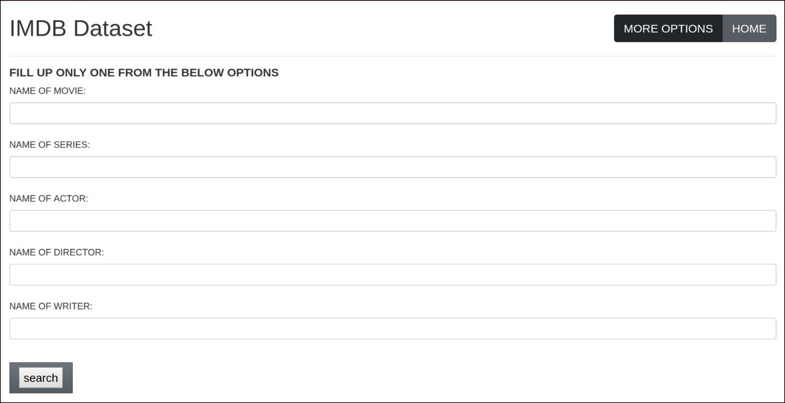

# IMDB Data Analyzer
IMDB Data Analyzer is a WebApp that allows users to perform complex filtering over a gigantic IMDB database and retrieve results efficiently.
It uses combined data extracted from OMDb API and official IMDB data set from (https://datasets.imdbws.com/), which comprises a large collection of movies, TV series, games, cast, crew and many more.

## Table of contents
* [Getting Started](#getting-started)
* [Installation](#installation)
* [Screenshots](#screenshots)
* [Creators](#creators)

## Getting Started
- Data is gathered from IMDB's official website as well as from OMDb API using Node.js HTTP requests.
- Data is preprocessed to handle any missing or inconsistent value. Post-preprocessing, a thorough analysis of database is done using Pandason Jupyter Notebook.
- Generated ER diagrams, build schema in 3NF form and stored tables in MySQL database.
- The commands for all the above are mentioned in the QUERY document.
- For front-end, simple HTML/CSS and JavaScript is used. The backend is coded in Express.JS to parse through MySQL database for easy and efficient query retrieval.

## Installation
- Copy all files or Clone the repository locally
- Install all the requirements using following command on npm 
```bash
npm install
```
- Run the server file
```node
node server.js
```
Go to the /public/html folder and run 'index.html' to run the webapp.


## Screenshots



## Creators:
**Devavrat Kalam**
- <https://github.com/kirito-k>

**Sarang Narkhede**
- <https://github.com/TheSarang>

**Viraj Chaudhari**
- <https://github.com/virajvchaudhari>

**Ashwani Kumar**
- <https://github.com/ashwani20>
